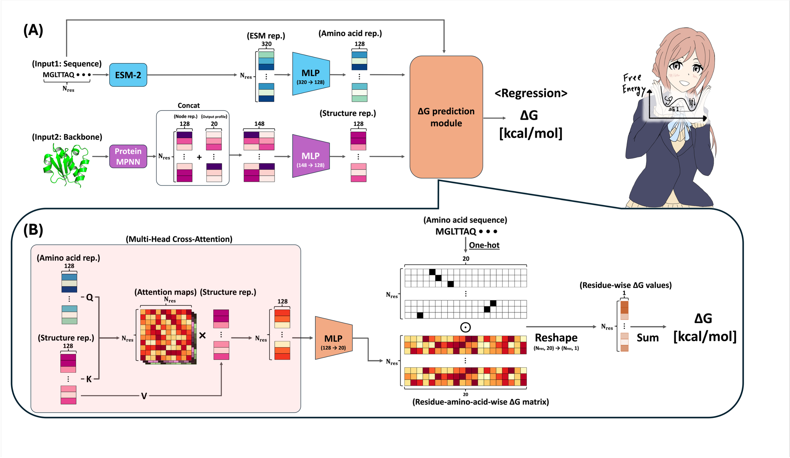

# RINAMI: Residue-attributed Interpretable Neural network for predicting Absolute folding free energy by Merging structure and sequence Information

    Tested environment:
    - NVIDIA Driver: 530.41.03
    - CUDA: 12.1
    - GPU: NVIDIA GeForce RTX 3080 (10GB)

Because of the data-size limitation, we put the all data used for model training and testing on the Zenodo strage: (Strage URL)

# Building an execution environment

Cloning this repository:

    git clone https://github.com/NaokiTOMITA1221/RINAMI_PROTEIN_SCIENCE.git
    cd RINAMI_PROTEIN_SCIENCE
    mkdir processed_data

After cloning this repository and making a directory named "processed_data" in the cloned repository, please download all data, deposited on Zenodo, into "processed_data" and unzip if you need.

Creation of the environment:

    conda env create -f RINAMI_env.yml 
    conda activate RINAMI_env
    pip install --no-cache-dir \
      torch-scatter torch-sparse torch-cluster torch-spline-conv \
      -f https://data.pyg.org/whl/torch-2.4.0+cu121.html

# Usage of RINAMI

    cd scripts
    python run_inference.py [your_pdb_path]
    

